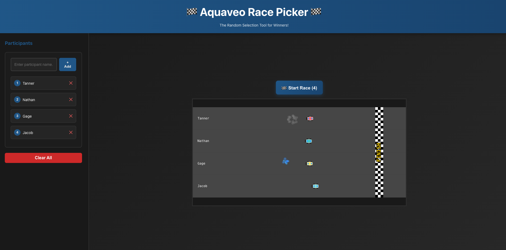
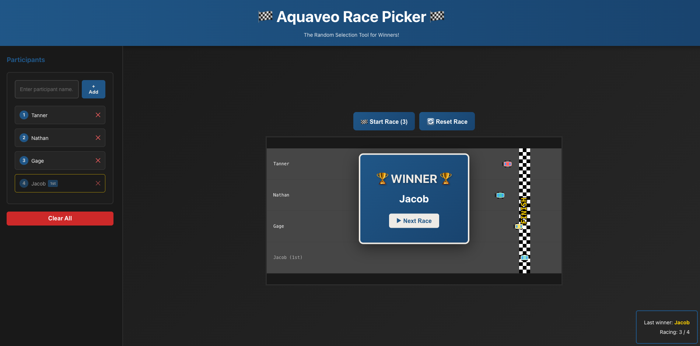
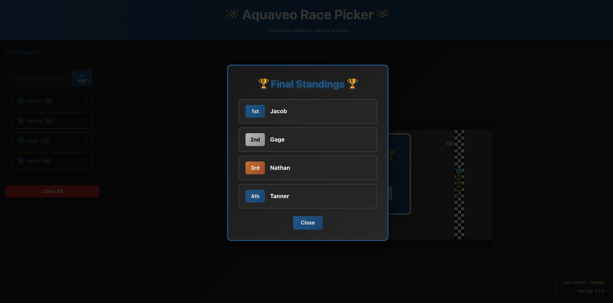

# 🏁 Aquaveo Race Picker

A Mario Kart-inspired random selection tool that turns picking winners into an exciting racing game!

## Screenshots

### Racing Game


### Winner Announcement


### Final Standings


## About

Aquaveo Race Picker is a web application that gamifies random selection. Instead of simply picking names from a list, participants are displayed as racing cars on a track, competing in dynamic races where the winner of each race is eliminated from the pool. This continues until all participants have been ranked, creating an engaging and fun way to determine winners or process selections.

## Features

- **Racing Modes**: Toggle between car racing and boat racing modes
  - **Car Mode**: Classic Mario Kart-style racing with detailed car models
  - **Boat Mode**: Nautical racing with sailboats complete with sails and bow waves
  - Easy one-click toggle in the header
- **Interactive Racing Track**: Canvas-based 2D overhead view with racers moving to the finish line
- **Dynamic Speed Mechanics**: Each racer experiences 2-4 random speed changes throughout the race (200-400 px/s) for unpredictable outcomes
- **Visual Effects**: 
  - Smoke particles emit when racers slow down significantly
  - Blue NOS-style flame particles when racers accelerate
  - Spinning effects during deceleration for realism
- **Persistent Track Layout**: All participants keep their lane visible throughout the tournament, even after elimination
- **Win Tracking**: Displays participant rankings (1st, 2nd, 3rd, etc.) on the track
- **Final Standings Dialog**: Shows all participants ranked by finish order when the tournament completes
- **Group Saving**: Save multiple participant lists to use later
  - Save current participant list with a custom name
  - View and manage saved groups
  - Load any saved group to quickly switch participant lists
  - Delete groups no longer needed
  - All groups persist with localStorage
- **Local Storage**: Participant list and groups are automatically saved and persist across sessions
- **Responsive Design**: Works on different screen sizes with a sidebar participant manager

## How to Use

### Switching Racing Modes

- Click the **"Switch to Boats"** or **"Switch to Cars"** button in the header
- The racing mode toggles between cars and boats
- The header emojis and vehicle visuals update instantly

### Running Races

1. **Add Participants**: Enter names in the sidebar and click "Add" (up to 12 participants)
2. **Start a Race**: Click "🏁 Start Race" when ready
3. **Watch the Race**: The canvas shows all participants racing to the finish line
4. **View Winner**: When someone crosses the finish line, their name appears as the winner
5. **Continue**: Click "▶ Next Race" to continue with remaining participants, or "Final Standings" when only one remains
6. **See Rankings**: View the final standings showing all participants in order

### Managing Groups

1. **Save a Group**: 
   - Build your participant list in the sidebar
   - Enter a name in the group name input field (or leave blank for auto-name)
   - Click "Save Current Group"
   
2. **Load a Group**:
   - Click "View Groups" to see all saved groups
   - Click "Load" on any group to switch to that participant list
   
3. **Delete a Group**:
   - Click "View Groups" 
   - Click "Delete" on any group to remove it
   
4. **Switch Between Groups**:
   - Groups can be switched at any time
   - When you load a group, the race state resets automatically

## Technology Stack

- **React 18** with TypeScript
- **Vite** for fast build and HMR
- **HTML5 Canvas** for race animations (60fps)
- **CSS3** with gradients and animations
- **localStorage** for data persistence

## Getting Started

### Prerequisites
- Node.js 16+
- npm or yarn

### Installation

```bash
npm install
```

### Development

```bash
npm run dev
```

The application will start at `http://localhost:5174`

### Building

```bash
npm run build
```

## Architecture

- **App.tsx**: Main state management and winner dialog logic
- **RacingGame.tsx**: Canvas rendering and race mechanics
- **EntryManager.tsx**: Participant list UI
- **App.css**: Main app styling and dialog designs
- **RacingGame.css**: Canvas and winner banner styling

## Future Enhancements

- Sound effects for races and winners
- Customizable race parameters
- Export results functionality
- Multiplayer network support
- Advanced car customization
