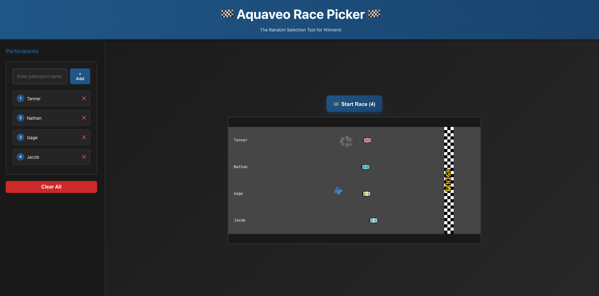
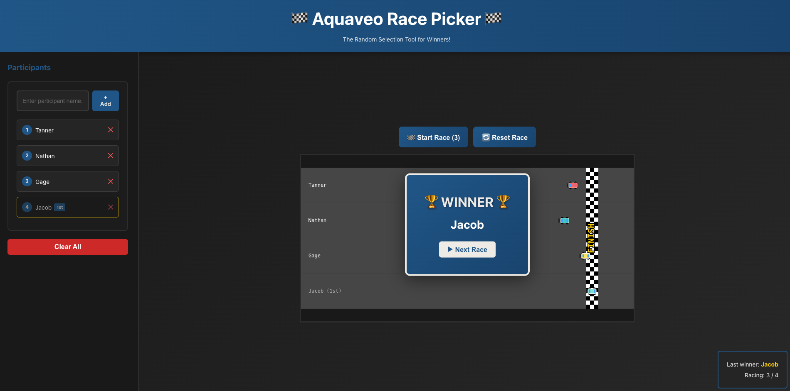
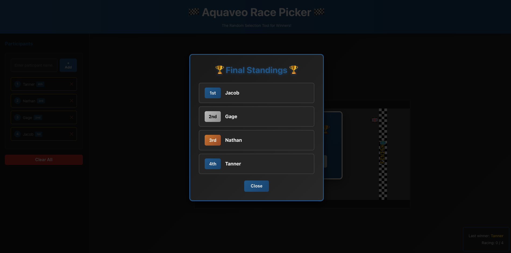

# 🎮 Aquaveo Picker

A gamified random-selection tool with eleven game modes — race cars, battle bots, light cycles, Plinko balls, wall climbers, a battleship grid, a spinning wheel, a kung-fu brawl, a retro Space Invaders assault (as the invaders or the defenders), or a one-on-one Street Duel — all sharing the same participant list.

## Game Modes

Pick a mode from the dropdown at the top of the page (use the 🎲 button next to it to jump to a random mode):

- **🏁 Racing** — Vehicle race across the canvas with 11 sub-modes (cars, boats, planes, balloons, rockets, ducks, snails, turtles, cats, dogs, mixed)
- **⚔️ Battle Bots** — Combat-arena elimination with weapons, hazards, takedowns, and instant replays. Last bot standing wins.
- **🏍️ Light Cycles** — Tron-inspired light-cycle elimination with AI personalities and power-ups. Last cycle standing wins.
- **🎯 Plinko** — Plinko ball drop with elemental effects on winners (fire, ice, green, lightning)
- **🧗 Wall Climber** — Vertical wall-climbing race with 10 sub-modes (cars, boats, planes, balloons, rockets, ducks, snails, cats, dogs, mixed)
- **🚢 Battleship** — Each participant gets a ship on an auto-sized grid; rapid-fire cannon, broadside, and depth-charge shots hunt and target ships until the first one is sunk (configurable ship sizes and visibility). Last ship afloat wins.
- **🎡 Wheel** — Classic spin-the-wheel picker; each spin selects and removes a name, with a running leaderboard and selectable tick sounds
- **🥋 Kung Fu** — Fighters brawl on a platform, throwing punches, kicks, flying kicks, and chi blasts to knock opponents off the edge, with instant replays and an optional shrinking sudden-death platform. Last fighter standing wins.
- **👾 Space Invaders** — Participants are the alien formation; an auto-cannon locks on with a target-lock drumroll and picks one off per wave. Features synth arcade sound, an accelerating march that continues across the whole session, and random theatrical powers/protections (shield, blink, rapid-fire, cloak) that never bias the fair pick. Last invader standing wins.
- **🛡️ Space Defenders** — The same engine flipped: participants are the defender cannons along the bottom while a descending alien horde bombs one base per wave. Last defender standing wins.
- **🥊 Street Duel** — Two participants are drawn at random each round for a Street Fighter-style 1v1 while everyone else watches from the crowd; the KO'd fighter is the pick. Each duelist is assigned a character from an 11-strong roster of original archetypes (Yogi, Sumo, Beast, Grappler, Boxer, General, Claw, Lightning, Commando, Kunoichi, Luchadora), each with a signature super unleashed from a fill-up meter — fireballs, flurries, piledrivers, spiral drills, kunai volleys, and more. Rounds cycle through 16 animated stages (city, jungle, space station, desert, dojo, harbor, night market, casino, wrestling arena, volcano, frozen peak, beach, waterfall, train roof, rainy alley, graveyard), each with its own 8-bit chiptune. KOs get an instant replay, and the final leaderboard ranks everyone by total damage inflicted across the session.

All modes share the same participant list and saved groups. Modes with a 🎛 Settings button (Racing, Wall Climber, Battleship, Wheel, Kung Fu, Space Invaders, Space Defenders, Street Duel) expose extra per-mode options in the ☰ header menu, which also holds the participant manager and a global sound mute. Switching modes mid-race prompts a confirmation and resets the current race.

## Screenshots

### Racing Game


### Winner Announcement


### Final Standings


## About

Aquaveo Picker is a web application that gamifies random selection. Instead of simply picking names from a list, participants compete in one of several animated game modes where the winner of each round is eliminated (or, in survival modes, the last one standing wins). This continues until all participants have been ranked, creating an engaging and fun way to determine winners or process selections.

## Features

- **Racing Modes**: Toggle between car, boat, plane, hot air balloon, rocket, duck, snail, turtle, cat, and dog modes
   - **Car Mode**: Classic Mario Kart-style racing with detailed car models
   - **Boat Mode**: Nautical racing with sailboats complete with sails and bow waves
   - **Plane Mode**: Aerial racing with airplanes featuring wings and contrails
   - **Balloon Mode**: Hot air balloons with baskets and rope rigging
   - **Rocket Mode**: Sleek rockets with fins, nose cone, and flame exhaust
   - **Duck Mode**: Cute ducks with beaks and wings
   - **Snail Mode**: Snails with shells and antennae
   - **Turtle Mode**: Turtles with shells and legs
   - **Cat Mode**: Cats with ears and tails
   - **Dog Mode**: Dogs with ears and wagging tails
   - **Mixed Mode**: A randomized mix of all racer types in a single race
   - Easy one-click toggle in the mode selector to switch between all modes
- **Interactive Racing Track**: Canvas-based 2D overhead view with racers moving to the finish line
- **Dynamic Speed Mechanics**: Each racer experiences 2-4 random speed changes throughout the race (200-400 px/s) for unpredictable outcomes
- **Visual Effects**: 
  - Smoke particles emit when racers slow down significantly
  - Blue NOS-style flame particles when racers accelerate
  - Spinning effects during deceleration for realism
- **Persistent Track Layout**: All participants keep their lane visible throughout the tournament, even after elimination
- **Win Tracking**: Displays participant rankings (1st, 2nd, 3rd, etc.) on the track
- **Final Standings Dialog**: Shows all participants ranked by finish order when the tournament completes
- **Group Saving**: Save multiple participant lists to use later
  - Save current participant list with a custom name
  - View and manage saved groups
  - Load any saved group to quickly switch participant lists
  - Delete groups no longer needed
  - All groups persist with localStorage
- **Local Storage**: Participant list and groups are automatically saved and persist across sessions
- **Responsive Design**: Works on different screen sizes with a sidebar participant manager

## How to Use

### Switching Racing Modes

- Use the **Racing mode** selector to choose between cars, boats, planes, balloons, rockets, ducks, snails, turtles, cats, dogs, or mixed
- The header emoji and racer visuals update instantly

### Running Races

1. **Add Participants**: Enter names in the sidebar and click "Add" (up to 20 participants)
2. **Start a Race**: Click "🏁 Start Race" when ready
3. **Watch the Race**: The canvas shows all participants racing to the finish line
4. **View Winner**: When someone crosses the finish line, their name appears as the winner
5. **Continue**: Click "▶ Next Race" to continue with remaining participants, or "Final Standings" when only one remains
6. **See Rankings**: View the final standings showing all participants in order

### Managing Groups

1. **Save a Group**: 
   - Build your participant list in the sidebar
   - Enter a name in the group name input field (or leave blank for auto-name)
   - Click "Save Current Group"
   
2. **Load a Group**:
   - Click "View Groups" to see all saved groups
   - Click "Load" on any group to switch to that participant list
   
3. **Delete a Group**:
   - Click "View Groups" 
   - Click "Delete" on any group to remove it
   
4. **Switch Between Groups**:
   - Groups can be switched at any time
   - When you load a group, the race state resets automatically

## Technology Stack

- **React 19** with TypeScript (strict)
- **Vite 7** for fast build and HMR
- **HTML5 Canvas** for race animations (60fps via `requestAnimationFrame`)
- **CSS3** with gradients and animations
- **localStorage** for data persistence (no backend)

## Getting Started

### Prerequisites
- Node.js 20.19+ or 22.12+ (required by Vite 7)
- npm

### Installation

```bash
npm install
```

### Development

```bash
npm run dev
```

The application will start at `http://localhost:5174`

### Building

```bash
npm run build
```

## Architecture

- **App.tsx** — Owns all mode-agnostic state (participants, groups, current mode, `eliminatedIds`, `winOrder`, current winner) and the mode dropdown. The active mode is rendered with a `key` of `${gameMode}-${resetKey}`, so switching mode or resetting fully remounts the mode component.
- **components/EntryManager.tsx** — Participant list with per-entry image upload (max 20 participants)
- **components/ManagementDialog.tsx** — Modal wrapping the participant manager and saved-group controls
- **components/FinalStandingsDialog.tsx** — Shared standings dialog used by all modes (reverses order for survival modes)
- **components/modes/&lt;ModeName&gt;/** — Each game is a self-contained mode under its own folder:
  - `RacingMode/` — vehicle race + 11 sub-mode toggle
  - `BattleBotsMode/` — combat arena (takedowns, replays, hazards)
  - `LightCyclesMode/` — Tron-style light cycles (AI personalities, power-ups)
  - `PlinkoMode/` — ball drop with elemental winner effects
  - `WallClimberMode/` — wall-climb race + 10 sub-mode toggle
  - `BattleshipMode/` — grid-based battleship picker (cannon/broadside/depth-charge shots, hunt+target AI, configurable ship sizes and visibility)
  - `WheelMode/` — spin-the-wheel picker with leaderboard and selectable sounds
  - `KungFuMode/` — platform brawler (moves, knock-offs, instant replay, optional shrinking platform)
  - `SpaceInvadersMode/` — retro Space Invaders family: **Space Invaders** (participants are the aliens) and **Space Defenders** (participants are the cannons) share one canvas engine, `SpaceGame`, parameterized by variant — target-lock suspense, synth sound, an escalating session-long march, and random powers
  - `DuelMode/` — Street Fighter-style 1v1 (11-character roster with signature supers, 16 chiptune-scored stages drawn from a no-repeat shuffle bag, instant replay, damage-based final standings)
- **components/modes/types.ts** — `ModeViewProps` contract every mode implements
- **components/modes/registry.ts** — `MODE_REGISTRY` wires each mode's view, optional settings panel, winner theme, label, and `survivalOrder` flag in one place
- **components/modes/themes.ts** — Per-mode `WinnerTheme` color/typography tokens
- **components/shared/** — `WinnerDialog` (themed winner card) and `SettingsModal` reused across modes
- **hooks/** — `useWinnerLifecycle` (winner-dialog expand/auto-minimize) and `useReplayRecorder` (generic ring-buffer replay for canvas modes)
- **utils/** — `colors`, `array` (shuffle), `storage` (safe localStorage helpers), `entryImages` (image-field accessors)

Each mode keeps its own persisted settings in a `*SettingsStore.ts` module (a singleton backed by `useSyncExternalStore`), rather than lifting that state into `App`.

## Future Enhancements

- Customizable race parameters
- Export results functionality
- Multiplayer network support
- Advanced car customization
